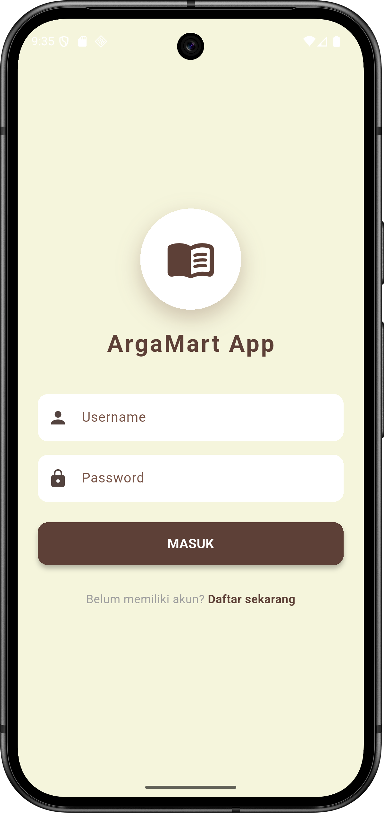
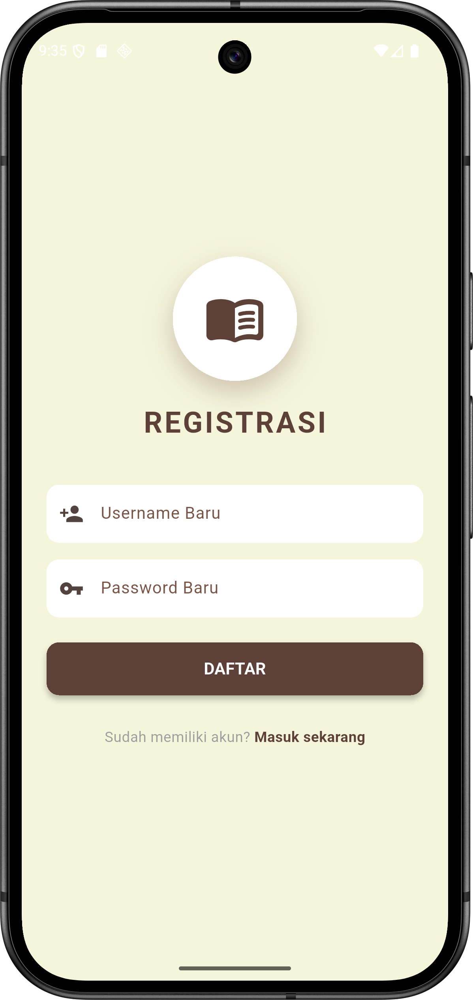
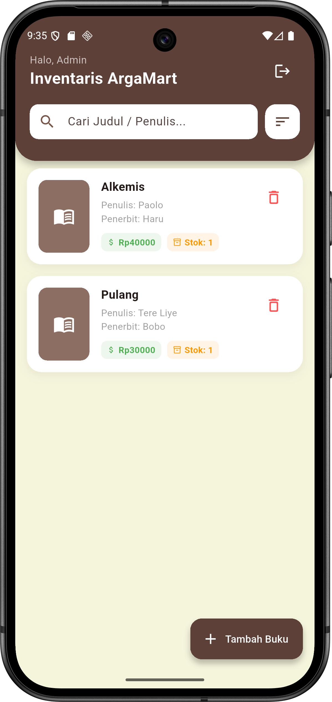
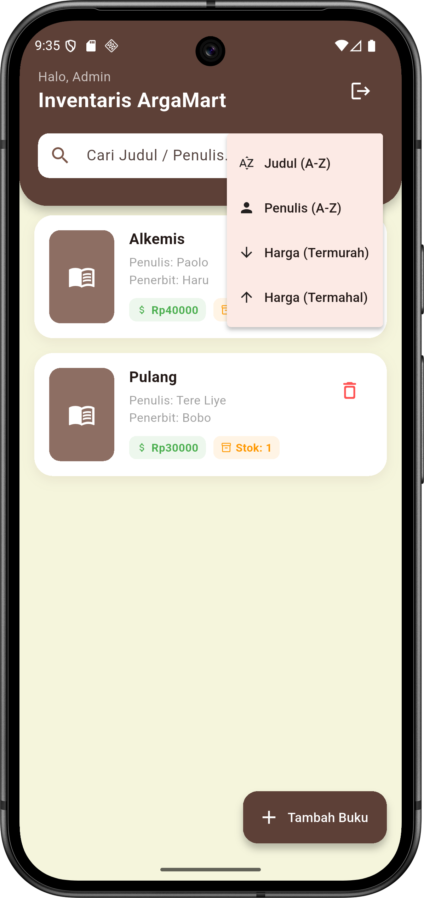
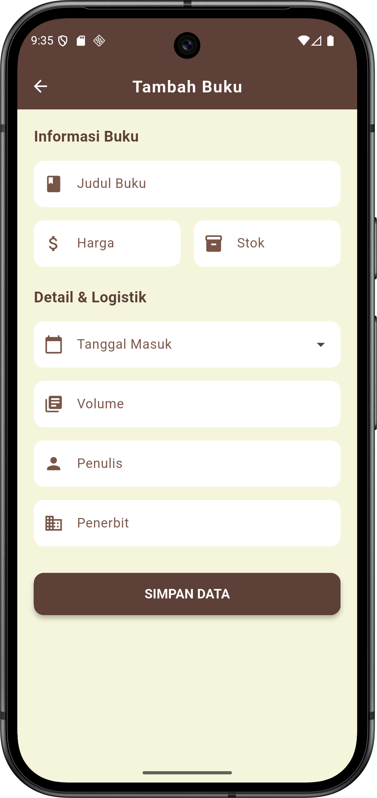
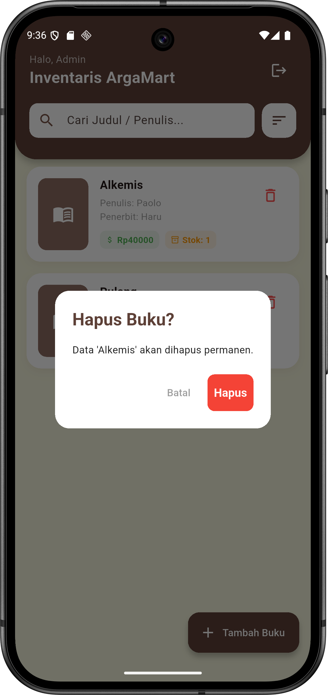

# Responsi 2 Mobile Paket 3 (NIM Anda)

- **Nama:** Arga Aryanta Indrafata
- **NIM:** H1D023096
- **Shift:** C
- **Shift Asal:** E

---

## Video Demo Aplikasi

Berikut adalah demonstrasi fitur aplikasi mulai dari Registrasi, Login, hingga operasi CRUD (Create, Read, Update, Delete) pada inventaris buku.

  <video src="demo_aplikasi.mp4" width="600" controls="controls" type="video/mp4">
  </video>

---

## Tech Stack & State Management

### Teknologi yang Digunakan

- **Frontend:** Flutter (Dart)
- **Backend:** Node.js (Express.js)
- **Database:** MySQL
- **HTTP Client:** Package `http`

### State Management: Flutter BLoC

Aplikasi ini menggunakan **BLoC (Business Logic Component)** untuk memisahkan logika bisnis dari antarmuka pengguna (UI).

- **Pemisahan Concern:** Logic aplikasi tidak bercampur dengan kode UI (`Widgets`). UI hanya bertugas me-render state yang diberikan oleh BLoC.
- **Event-Driven:** UI mengirimkan _Event_ (contoh: `LoadBukuEvent`, `LoginEvent`), dan BLoC merespons dengan _State_ (contoh: `BukuLoaded`, `AuthSuccess`).
- **Reactivity:** Menggunakan `BlocBuilder` dan `BlocListener` untuk merespons perubahan data secara _real-time_ tanpa perlu melakukan `setState` manual yang berlebihan.

---

## Spesifikasi API (Backend Node.js)

Backend dibangun menggunakan **Node.js** dan **Express** yang terhubung ke database **MySQL**.

### 1. Autentikasi (`/login`, `/register`)

- **Register (POST):** Menerima `username` dan `password` untuk membuat akun pegawai baru.
- **Login (POST):** Memverifikasi kredensial. Jika sukses, mengembalikan status `true`.

### 2. Inventaris Buku (`/read`, `/create`, `/update`, `/delete`)

| Fitur           | Endpoint  | Method | Parameter Body (JSON)                                                              |
| :-------------- | :-------- | :----- | :--------------------------------------------------------------------------------- |
| **Lihat Data**  | `/read`   | `GET`  | -                                                                                  |
| **Tambah Data** | `/create` | `POST` | `judul`, `harga`, `jumlah`, `tanggal_masuk`, `volume`, `penulis`, `penerbit`       |
| **Ubah Data**   | `/update` | `POST` | `id`, `judul`, `harga`, `jumlah`, `tanggal_masuk`, `volume`, `penulis`, `penerbit` |
| **Hapus Data**  | `/delete` | `POST` | `id`                                                                               |

---

## Penjelasan Kode & Struktur Folder

Berikut adalah rincian fungsi dari setiap komponen dalam aplikasi:

### 1. Konfigurasi Utama (`main.dart`)

- **Entry Point:** Fungsi `main()` menjalankan aplikasi.
- **MultiBlocProvider:** Menyuntikkan (`inject`) `AuthBloc` dan `BukuBloc` ke seluruh pohon widget aplikasi agar state dapat diakses dari halaman manapun.
- **Theme Data:** Mengatur tema global aplikasi, termasuk warna utama (Coklat/`Colors.brown`), font (`Roboto`), dan gaya input form agar konsisten.

### 2. Layer Data (`repositories/`)

Bertugas melakukan komunikasi HTTP request ke server Node.js.

- **`auth_repository.dart`:** Menangani request ke endpoint `/login` dan `/register`. Melakukan _parsing_ respons JSON dari server untuk mengecek status keberhasilan login.
- **`buku_repository.dart`:** Menangani operasi CRUD.
  - `getBuku()`: Mengambil list data buku dari endpoint `/read`.
  - `saveBuku()`: Menangani logika simpan, otomatis memilih endpoint `/create` atau `/update` berdasarkan status edit.
  - `deleteBuku()`: Mengirim request penghapusan data berdasarkan ID.

### 3. Layer Logic (`blocs/`)

Mengelola state aplikasi berdasarkan event yang diterima.

- **`auth_bloc.dart`:**
  - Menerima `LoginEvent` -> Mengubah state menjadi `AuthLoading` -> Memanggil Repository -> Mengeluarkan `AuthSuccess` atau `AuthFailure`.
- **`buku_bloc.dart`:**
  - Mengelola state list buku (`BukuLoaded`), loading, dan error.
  - Memastikan data di-refresh (`LoadBukuEvent`) otomatis setelah operasi Tambah/Edit/Hapus berhasil.

### 4. Layer UI - Halaman (`screens/`)

- **`login_page.dart` & `register_page.dart`:**
  - Halaman autentikasi dengan desain modern.
  - Menggunakan `BlocListener` untuk navigasi otomatis jika login/register sukses, atau menampilkan _Snackbar_ jika gagal.
- **`home_page.dart` (Halaman Utama):**
  - **Header Custom:** Menampilkan salam admin dan tombol logout.
  - **Fitur Search & Sort:** Melakukan filter dan pengurutan data (Harga, Nama, Penulis) di sisi klien (_client-side filtering_) sebelum data ditampilkan ke `ListView`.
  - **BlocBuilder:** Membangun tampilan berdasarkan state: Loading (Spinner), Loaded (Daftar Buku), atau Error (Pesan Kesalahan).
- **`form_page.dart` (Tambah/Edit):**
  - **Reusability:** Satu halaman digunakan untuk dua fungsi (Tambah & Edit). Jika ada data buku yang dikirim, form otomatis terisi (Mode Edit).
  - **Date Picker:** Mengimplementasikan input tanggal interaktif untuk kolom "Tanggal Masuk".

### 5. Layer UI - Widget Kustom (`widgets/`)

- **`book_card.dart`:**
  - Komponen kartu untuk menampilkan ringkasan buku (Judul, Penulis, Harga, Stok).
  - Memiliki interaksi: Klik kartu untuk **Edit**, klik ikon tong sampah untuk **Hapus**.
- **`dialog_popup.dart`:**
  - Kelas utilitas statis untuk memanggil _Alert Dialog_.
  - Digunakan untuk konfirmasi Logout dan konfirmasi Hapus data, menjaga kode UI utama tetap bersih.

---

## Screenshot Aplikasi

  
  &nbsp;
  
  &nbsp;
  
  &nbsp;
  
  &nbsp;
  
  &nbsp;
  

